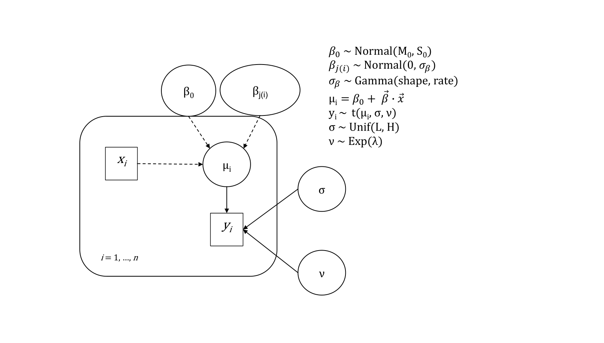

```{r setup, include=FALSE}
knitr::opts_chunk$set(echo = TRUE)
Sys.setenv(lang="us_en")
rm(list=ls())
setwd("F:/UZH/22Spring/BDAM/BDAM/Assignment2/analysis_code")
```

$~$

### Part 1

The goal of this task is to compare the *intertemporal choice heuristic* (ITCH) model with the *difference-ratio-interest-finance-time* (DRIFT) model across five closely related conditions:

* **Condition 1:** Absolute money value, delay framing (e.g., \$5 today vs. \$5 plus an additional \$5 in 4 weeks)
* **Condition 2:** Relative money value, delay framing (e.g., \$5 today vs. \$5 plus an additional 100\% in 4 weeks)
* **Condition 3:** Standard MEL format (e.g., \$5 today vs. \$10 in 4 weeks)
* **Condition 4:** Absolute money value, speedup framing (e.g., \$10 in 4 weeks vs. \$10 minus \$5 today)
* **Condition 5:** Relative money value, speedup framing (e.g., \$10 in 4 weeks vs. \$10 minus 50\% today)

#### Bayesian hierarchical logistic regression

DRIFT (Difference Ratio Interest Finance Time) model:
$$
\texttt{LaterOptionChosen ~ Intercept + DriftD + DriftR + DriftI + DriftT}  
$$

ITCH (Intertemporal Choice Heuristics) model:
$$
\texttt{LaterOptionChosen ~ Intercept + G + R + D + T}
$$

Since DRIFT model and ITCH model take the same form (four regressors with intercept), we can write one single text file for these two models:

```{r}
if (!file.exists("./models/model4part1.txt")) {
  cat("model {
      for (k in 1:Nx) {
        b.mu[k] ~ dnorm(0, 0.0000001) # prior for coefficients (including intercept)
        b.sig[k] ~ dunif(0.1, 100)    # prior for coefficients error
      }
      
      for (j in 1:Nsubj) {
       for (k in 1:Nx) {
        b.s[j, k] ~ dnorm(b.mu[k], 1/b.sig[k]^2) # precision = 1/b.sig[k]^2
       }
      }
      
      for (i in 1:Ntotal) {
        p[i] = ilogit( sum(b.s[subIdx[i], 1:Nx] * x[i, 1:Nx]) )
        y[i] ~ dbern(p[i])
        ly[i] = log(p[i])
      }
    }", file="./models/model4part1.txt")
} else {
  print("The text file already existed!")
}
```

```{r, warning=FALSE, message=FALSE, results="hold"}
## Load required packages
library(ggplot2)
library(GGally)
library(rjags)
library(runjags)
library(HDInterval)
library(data.table)

source("lib/deps.R")
```

```{r}
## NOTE: the code in this chunk is modified from HierarchicalMultipleLinearRegr_loopX.Rmd

## Set seed for reproducible results
set.seed(44566) 

## Define fit.model function
## Args: data, drift
fit.model <- function(data, drift=TRUE) {
  
  # Generate sequential indices for participant IDs
  subIdx <- rep(1:length(table(data$Subject)), times=as.integer(table(data$Subject)))
  Nsubj <- length(unique(subIdx))
  y <- data$LaterOptionChosen
  
  ## Create the design matrix for DRIFT model or ITCH model
  if (drift) {
    x <- model.matrix(~ DriftD + DriftR + DriftI + DriftT, data=data)
  } else {
    x <- model.matrix(~ G + R + D + T, data=data)
  }
  Nx <- ncol(x)
  Ntotal <- nrow(x)
  
  ## Prepare data for JAGS
  dat.jags <- dump.format(list(
    x = x, 
    y = y, 
    subIdx = subIdx, 
    Nsubj = Nsubj, 
    Nx = Nx, 
    Ntotal = Ntotal
  ))
  
  ## Initialize the chains
  inits1 <- dump.format(list(b.mu = runif(Nx, -2, 2), .RNG.name="base::Super-Duper", .RNG.seed=99999 ))
  inits2 <- dump.format(list(b.mu = runif(Nx, -2, 2), .RNG.name="base::Wichmann-Hill", .RNG.seed=1234))
  inits3 <- dump.format(list(b.mu = runif(Nx, -2, 2), .RNG.name="base::Mersenne-Twister", .RNG.seed=6666 ))
  
  ## Tell JAGS which latent variables to monitor
  monitor <- c("b.mu")
  
  results <- run.jags(model = "./models/model4part1.txt", 
                      monitor = monitor, 
                      data = dat.jags, 
                      n.chains = 3, 
                      inits = c(inits1, inits2, inits3), 
                      burnin = 200, 
                      sample = 200, 
                      thin = 1)
  
  return(results)
}
```

Fit DRIFT model to the data:
```{r}
drift.results1 <- fit.model(data=load.data(1))
drift.results2 <- fit.model(data=load.data(2))
drift.results3 <- fit.model(data=load.data(3))
drift.results4 <- fit.model(data=load.data(4))
drift.results5 <- fit.model(data=load.data(5))
```

Fit ITCH model to the data:
```{r}
itch.results1 <- fit.model(data=load.data(1), drift=FALSE)
itch.results2 <- fit.model(data=load.data(2), drift=FALSE)
itch.results3 <- fit.model(data=load.data(3), drift=FALSE)
itch.results4 <- fit.model(data=load.data(4), drift=FALSE)
itch.results5 <- fit.model(data=load.data(5), drift=FALSE)
```

#### Correlation and density plots

Correlation and density plots for DRIFT model:
```{r}
ggpairs(as.data.frame(
  rbind(drift.results1[["mcmc"]][[1]], 
        drift.results1[["mcmc"]][[2]], 
        drift.results1[["mcmc"]][[3]])
), title="DRIFT - Condition 1")

ggpairs(as.data.frame(
  rbind(drift.results2[["mcmc"]][[1]], 
        drift.results2[["mcmc"]][[2]], 
        drift.results2[["mcmc"]][[3]])
), title="DRIFT - Condition 2")

ggpairs(as.data.frame(
  rbind(drift.results3[["mcmc"]][[1]], 
        drift.results3[["mcmc"]][[2]], 
        drift.results3[["mcmc"]][[3]])
), title="DRIFT - Condition 3")

ggpairs(as.data.frame(
  rbind(drift.results4[["mcmc"]][[1]], 
        drift.results4[["mcmc"]][[2]], 
        drift.results4[["mcmc"]][[3]])
), title="DRIFT - Condition 4")

ggpairs(as.data.frame(
  rbind(drift.results5[["mcmc"]][[1]], 
        drift.results5[["mcmc"]][[2]], 
        drift.results5[["mcmc"]][[3]])
), title="DRIFT - Condition 5")
```

Correlation and density plots for ITCH model:
```{r}
ggpairs(as.data.frame(
  rbind(itch.results1[["mcmc"]][[1]], 
        itch.results1[["mcmc"]][[2]], 
        itch.results1[["mcmc"]][[3]])
), title="ITCH - Condition 1")

ggpairs(as.data.frame(
  rbind(itch.results2[["mcmc"]][[1]], 
        itch.results2[["mcmc"]][[2]], 
        itch.results2[["mcmc"]][[3]])
), title="ITCH - Condition 2")

ggpairs(as.data.frame(
  rbind(itch.results3[["mcmc"]][[1]], 
        itch.results3[["mcmc"]][[2]], 
        itch.results3[["mcmc"]][[3]])
), title="ITCH - Condition 3")

ggpairs(as.data.frame(
  rbind(itch.results4[["mcmc"]][[1]], 
        itch.results4[["mcmc"]][[2]], 
        itch.results4[["mcmc"]][[3]])
), title="ITCH - Condition 4")

ggpairs(as.data.frame(
  rbind(itch.results5[["mcmc"]][[1]], 
        itch.results5[["mcmc"]][[2]], 
        itch.results5[["mcmc"]][[3]])
), title="ITCH - Condition 5")
```

#### Summary tables

Summary tables for DRIFT model:
```{r}
knitr::kable(summary(drift.results1), caption="DRIFT - Condition 1", digits=6, align="c")
knitr::kable(summary(drift.results2), caption="DRIFT - Condition 2", digits=6, align="c")
knitr::kable(summary(drift.results3), caption="DRIFT - Condition 3", digits=6, align="c")
knitr::kable(summary(drift.results4), caption="DRIFT - Condition 4", digits=6, align="c")
knitr::kable(summary(drift.results5), caption="DRIFT - Condition 5", digits=6, align="c")
```

Summary tables for ITCH model:
```{r}
knitr::kable(summary(itch.results1), caption="ITCH - Condition 1", digits=6, align="c")
knitr::kable(summary(itch.results2), caption="ITCH - Condition 2", digits=6, align="c")
knitr::kable(summary(itch.results3), caption="ITCH - Condition 3", digits=6, align="c")
knitr::kable(summary(itch.results4), caption="ITCH - Condition 4", digits=6, align="c")
knitr::kable(summary(itch.results5), caption="ITCH - Condition 5", digits=6, align="c")
```

$~$

### Part 2

Assumption: the variance is homogeneous across different conditions

Conditions:

* Condition 1: Absolute Gains
* Condition 2: Relative Gains
* Condition 3: Standard MEL
* Condition 4: Absolute Losses
* Condition 5: Relative Losses

Graphical representation: 
```{r, echo=FALSE, fig.cap="Graphical representation of Bayesian hierarchical logistic regression"}

```

#### Bayesian one-way ANOVA

```{r}
## Look at the JAGS model (from the lecture script OneFactorAnovaHomVar.R)
writeLines(readLines("./models/1way_ANOVA_homogenous_var.txt"))
```


```{r}
## NOTE: code in this chunk is modified from the lecture script OneFactorAnovaHomVar.R
source("moustache_plot.r")
gammaShRaFromModeSD <- function(mode, sd) {
  if (mode <= 0) stop("mode must be > 0")
  if (sd <= 0) stop("sd must be > 0")
  rate = (mode + sqrt( mode^2 + 4 * sd^2 )) / (2 * sd^2)
  shape = 1 + mode * rate
  return(c(shape, rate))
}

DT <- data.table(load.data(0))

DT <- DT[, list(LaterOptionChosenRate = mean(LaterOptionChosen)), by=c("Subject", "Condition")]

# Using code provided in lecture:
# Convert data file columns to generic x,y variable names for model:
y <- as.numeric(DT$LaterOptionChosenRate)
x <- as.numeric(as.factor(DT$Condition))
xlevels <- levels(as.factor(DT$Condition))
Ntotal <- length(y)
NxLvl <- length(unique(x))
# Compute scale properties of data, for passing into prior to make the prior
# vague on the scale of the data. 
# For prior on baseline, etc.:
yMean <- mean(y)
ySD <- sd(y)
# For hyper-prior on deflections:
agammaShRa <- gammaShRaFromModeSD(mode=sd(y)/2, sd=2*sd(y))
# Specify the data in a list for sending to JAGS:
dataList <- list(
  y = y, 
  x = x, 
  Ntotal = Ntotal, 
  NxLvl = NxLvl, 
  # data properties for scaling the prior:
  yMean = yMean, 
  ySD = ySD,  
  agammaShRa = agammaShRa 
)

#------------------------------------------------------------------------------
# INTIALIZE THE CHAINS.

DT.group <- DT[, list(Mean=mean(LaterOptionChosenRate), SD=sd(LaterOptionChosenRate)), by="Condition"]

initsList <- list(
  a0 = yMean ,
  a = DT.group$Mean - yMean ,
  ySigma = mean(DT.group$SD)
  # Let JAGS do other parameters automatically...
)

inits1 <- dump.format(c(initsList, list(.RNG.name="base::Super-Duper", .RNG.seed=99999)))
inits2 <- dump.format(c(initsList, list(.RNG.name="base::Wichmann-Hill", .RNG.seed=1234)))
inits3 <- dump.format(c(initsList, list(.RNG.name="base::Mersenne-Twister", .RNG.seed=6666)))

#------------------------------------------------------------------------------
# RUN THE CHAINS
monitor <- c("b0", "b", "m", "aSigma", "ySigma")
adaptSteps <- 500 
burnInSteps <- 5000
nChains <- 3
results <- run.jags(model = "./models/1way_ANOVA_homogenous_var.txt", 
                    monitor = monitor, 
                    data = dataList,  
                    inits = c(inits1, inits2, inits3), 
                    n.chains = nChains,
                    adapt = adaptSteps,
                    burnin = burnInSteps, 
                    sample = 5000,
                    thin = 1,
                    summarise = FALSE,
                    plots = FALSE)
```

```{r}
## Print the summary results in a table 
knitr::kable(summary(results), digits=6, align="c", caption="Summary results for Bayesian one-way ANOVA")
```

```{r}
## Look at the structure of MCMC samples from the first chain
rmarkdown::paged_table(data.frame(results$mcmc[[1]]))
```

```{r, results="asis"}
chains <- results$mcmc
b.samples <- as.data.frame(rbind(chains[[1]][, 2:6], chains[[2]][, 2:6], chains[[3]][, 2:6]))
names(b.samples) <- c("Condition1", "Condition2", "Condition3", "Condition4", "Condition5")
knitr::kable(summary(b.samples), caption="Summary statistics for five conditions")
```

#### Moustache plot

```{r}
## Moustache Plot
plotMoustache(chains, as.data.frame(DT), yName = "LaterOptionChosenRate", xName = "Condition")
```

#### Contrasts

Idea: Construct the desired contrasts (i.e. difference) based on the samples and visualize the sample posterior distributions.

```{r, echo=FALSE}
d.contrasts <- data.frame(matrix(c("-1", "0", "1", "0", "0", 
                                   "0", "-1", "1", "0", "0", 
                                   "0", "0", "1", "-1", "0", 
                                   "0", "0", "1", "0", "-1", 
                                   "1/2", "-1/2", "0", "1/2", "-1/2"), nrow=5, byrow=TRUE))
colnames(d.contrasts) <- c("Condition 1", "Condition 2", "Condition 3", "Condition 4", "Condition 5")
rownames(d.contrasts) <- c("Standard MEL vs. Absolute Gains", 
                           "Standard MEL vs. Relative Gains", 
                           "Standard MEL vs. Absolute Losses", 
                           "Standard MEL vs. Relative Losses", 
                           "Absolute Condition vs. Relative Condition")
knitr::kable(d.contrasts, align="c", caption="Contrasts table")
```

Standard MEL vs. Absolute Gains: 
```{r}
## Region of practical equivalence
ROPE <- c(-0.1, 0.1)

dif <- b.samples$Condition3 - b.samples$Condition1
d.density <- with(density(dif), data.frame(x, y))
ggplot(data=d.density, mapping=aes(x=x, y=y)) +
  geom_area(aes(x=ifelse(x>hdi(dif)[1] & x<hdi(dif)[2], x, 0), y=y), fill=2, alpha=0.2) + 
  geom_line(color=2) + ylim(0, 20) + geom_vline(xintercept=ROPE, linetype="longdash", color="red") + 
  labs(title="Standard MEL vs. Absolute Gains", x="Difference", y="Density") 
```

Standard MEL vs. Relative Gains:
```{r, warning=FALSE}
dif <- b.samples$Condition3 - b.samples$Condition2
d.density <- with(density(dif), data.frame(x, y))
ggplot(data=d.density, mapping=aes(x=x, y=y)) +
  geom_area(aes(x=ifelse(x>hdi(dif)[1] & x<hdi(dif)[2], x, NA), y=y), fill=3, alpha=0.2) +
  geom_line(color=3) + ylim(0, 20) + geom_vline(xintercept=ROPE, linetype="longdash", color="red") + 
  labs(title="Standard MEL vs. Relative Gains", x="Difference", y="Density")
```

Standard MEL vs. Absolute Losses: 
```{r, warning=FALSE}
dif <- b.samples$Condition3 - b.samples$Condition4
d.density <- with(density(dif), data.frame(x, y))
ggplot(data=d.density, mapping=aes(x=x, y=y)) +
  geom_area(aes(x=ifelse(x>hdi(dif)[1] & x<hdi(dif)[2], x, NA), y=y), fill=4, alpha=0.2) +
  geom_line(color=4) + ylim(0, 20) + geom_vline(xintercept=ROPE, linetype="longdash", color="red") +
  labs(title="Standard MEL vs. Absolute Losses", x="Difference", y="Density")
```

Standard MEL vs. Relative Losses:
```{r, warning=FALSE}
dif <- b.samples$Condition3 - b.samples$Condition5
d.density <- with(density(dif), data.frame(x, y))
ggplot(data=d.density, mapping=aes(x=x, y=y)) +
  geom_area(aes(x=ifelse(x>hdi(dif)[1] & x<hdi(dif)[2], x, NA), y=y), fill=5, alpha=0.2) +
  geom_line(color=5) + ylim(0, 20) + geom_vline(xintercept=ROPE, linetype="longdash", color="red") + 
  labs(title="Standard MEL vs. Relative Losses", x="Difference", y="Density")
```

Absolute Condition vs. Relative Condition: 
```{r, warning=FALSE}
dif <- (b.samples$Condition1 + b.samples$Condition4)/2 - (b.samples$Condition2 + b.samples$Condition5)/2
d.density <- with(density(dif), data.frame(x, y))
ggplot(data=d.density, mapping=aes(x=x, y=y)) +
  geom_area(aes(x=ifelse(x>hdi(dif)[1] & x<hdi(dif)[2], x, NA), y=y), fill=6, alpha=0.2) +
  geom_line(color=6) + ylim(0, 25) + geom_vline(xintercept=ROPE, linetype="longdash", color="red") +
  labs(title="Absolute Condition vs. Relative Condition", x="Difference", y="Density")
```

