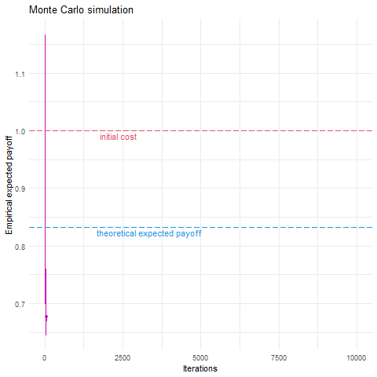

# BDAM
This repository is made for the course *[Bayesian Data Analysis and Models of Behavior](info/2022-Lecture-topic-list.pdf)*

| Content                    | Assignment                                                   | Solutions                                                    |
| -------------------------- | ------------------------------------------------------------ | ------------------------------------------------------------ |
| Metropolis algorithm       | [Assignment 1](Assignment1/Assignment1.pdf)                  | [Solution 1](Assignment/Assignment1-TuWenjie.Rmd)            |
| Reward learning            | [Assignment 2](Assignment2/Assignment2+papers/Assignment2_2022.pdf) | [Solution 2](Assignment2/analysis_code/Assignment2-TuWenjie.Rmd) |
| Censored regression models | [Assignment 3](Assignment3/Assignment_3.pdf)                 | [Solution 3](Assignment3/Assignment3-TuWenjie.Rmd)           |
| Model comparison           | [Assignment 4](Assignment4/Assignment_4.pdf)                 | [Solution 4](Assignment4/Assignment4-TuWenjie.Rmd)           |

